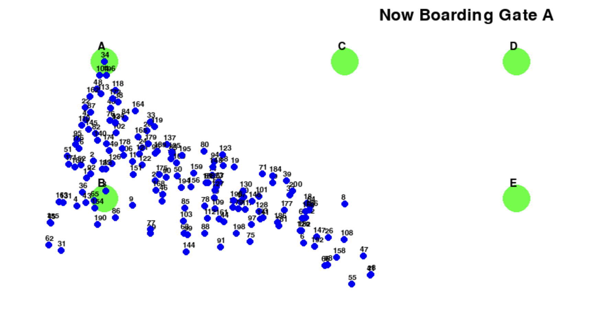

# Airport-Simulation – Parallel Computing Project

## Project Overview
This project simulates the **day-to-day operations of an international airport** on a small scale.  
It models **flight scheduling, passenger behavior, security queues, gate assignments, and seat reservations** using **Python multithreading, concurrency, and databases**.  

Key features include:
- **FastClock**: compresses a full day into minutes by simulating accelerated time  
- **Flights**: randomly scheduled with delays, gate assignments, and passenger boarding  
- **Passengers**: simulate booking, check-in, security, and boarding processes  
- **Concurrency**: passengers, flights, and staff run in parallel using `threading`  
- **Database Integration**: stores passenger and flight data in a MySQL database  
- **Reports**: generates CSV files summarizing flight delays, passenger boarding, and missed flights  
- **Visualization**: interactive **Pygame** window to visualize passengers moving to gates  

This project was developed as part of the **Operating Systems & Parallel Computing (OPS&PC)** course:contentReference[oaicite:0]{index=0}.

---

## Project Structure
```text
Airport-Simulation/
│
├── AirportVisFINAL.py                   # Main simulation code
├── requirements.txt                     # Python dependencies
├── flight_report_*.csv                  # Example generated flight reports
├── passengers_data.csv                  # Example passenger dataset (SQL export)
├── Screenshot 2025-09-04 at 12.24.31.png # Example Pygame visualization
├── OPS&PC-Final report (1) (2).pdf       # Full project report
└── README.md                            # Documentation
```
---

## Installation

1. **Clone the repository**
```bash
git clone https://github.com/pilarguerreromorales/Airport-Simulation-Parallel-Computing.git
cd Airport-Simulation-Parallel-Computing
```
2. **Create and activate a virtual environment (recommended)**
```bash
python3 -m venv venv

# macOS/Linux
source venv/bin/activate

# Windows (PowerShell)
venv\Scripts\Activate.ps1

# Windows (CMD)
venv\Scripts\activate
```

3. **Install dependencies**
```bash
pip install -r requirements.txt
```

## Usage

Run the main program with:
```bash
python AirportVisFINAL.py
```

This will:
1. Initialize flights, passengers, and security staff
2. Run a simulated 24-hour airport day (time accelerated)
3. Save reports:
  - flight_report_<timestamp>.csv → Flight performance (delays, boarded & missed passengers)
  - passengers_data.csv → Passenger behavior logs stored via SQL
4. Launch an interactive Pygame visualization of passengers moving through the airport at the end of the program

## Example Outputs

### Flight Report (CSV excerpt)
```csv
Flight ID,Scheduled Departure,Actual Departure,Delay (minutes),Passengers Boarded,Passengers Missed
Flight-213,2025-09-04 12:00,2025-09-04 12:25,25,45,5
```

### Passenegr Report (CSV excerpt)
```csv
passenger_num,passenger_id,preference,booked_flight,passed_security,arrival_time
1,1,economy,Flight-213,TRUE,2025-09-04 10:45:00
```

### Visualization Example


---

## Requirements

The project depends on the following main libraries (see requirements.txt for exact versions):
- pandas – data analysis & CSV export
- matplotlib – plotting graphs
- openpyxl – Excel file support
- graphics.py – simple graphics for GUI
- pygame – simulation visualization

## Authors
Pilar Guerrero
James Hanuso
Andrea Saxod
  
